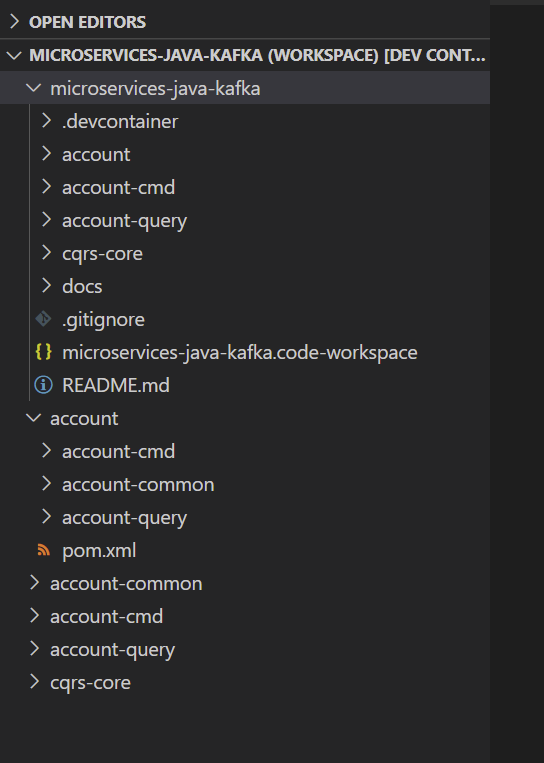

# CQRS & Event Sourcing w/ Spring Boot and Apache Kafka.

This is the case study project built during the course [Learn how to create microservices that are based on CQRS & Event Sourcing. Powered by Spring Boot and Apache Kafka.](https://www.udemy.com/course/java-microservices-cqrs-event-sourcing-with-kafka/) 

# Tools

Use Visual Studio code with remote containers extension - a configuration is included in this repository.

# Debug and test

* Ensure that MongoDB, MySQL, Kafka, and Zookeeper containers are running and reachable from your machine.
* Run both `AccountCommandApplication`  and `AccountQueryApplication`
* Use the sample REST invocations, like in [this folder](./rest-client/) (using [VSC REST Client extension](https://marketplace.visualstudio.com/items?itemName=humao.rest-client)).

